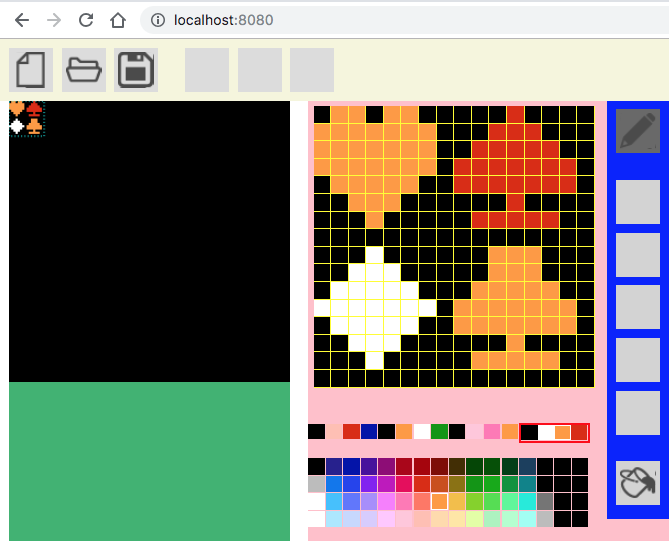

# chrEditor
Sprite Editor of NES(Nintendo Entertainment System) at Web
## Description
 This is Sprite Editor (Graphic Editor) for Game of Nintendo Entertainment System
at Web System. I'm writing this source code by JavaScript (using React,Bootstrap,
and so on...).

## Demo

## VS. 
  

## Requirement

## Usage

## Install

## Contribution

## Licence

## Author

